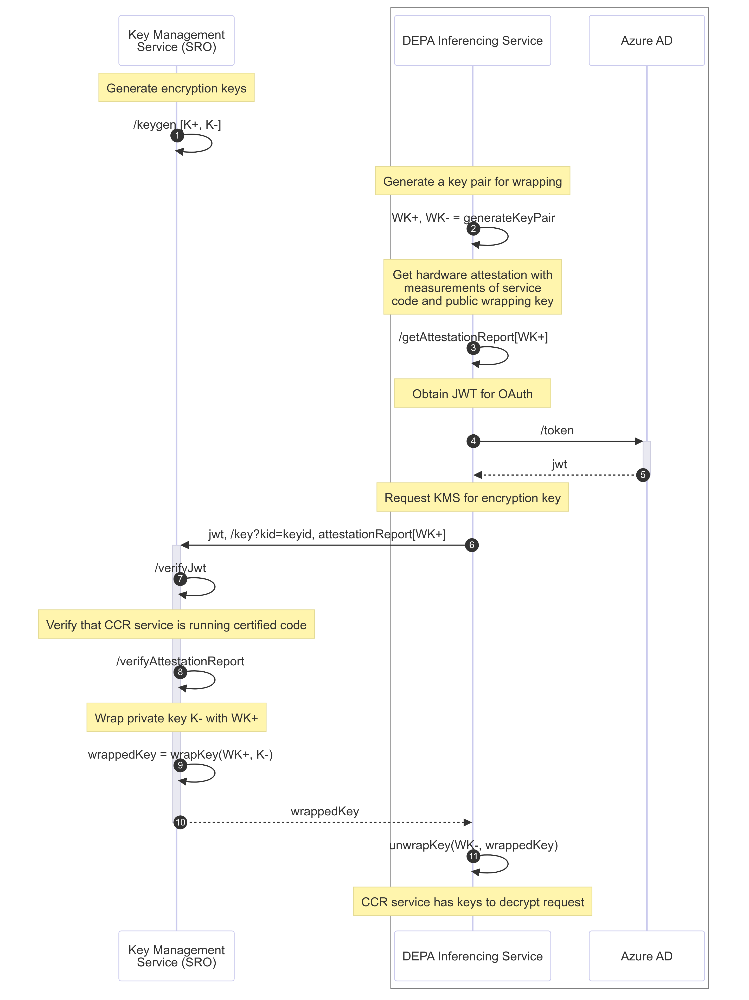

# Key Management on Azure
In DEPA inferencing, encryption keys are generated within a key management service hosted by a sector-specific SRO. The private keys are distributed to DEPA inferencing services deployed in TEEs after attesting that the services are running known good code in the right configuration. The following diagram illustrates the attestation and key release protocol. 

1. A confidential and transparent key management service hosted by the SRO periodically generates [Hybrid Public Key Encryption][1] (HPKE) keys. Each key is a key pair (represented by K+ and K-). Keys are generated within the key management service and remain protected within TEEs.  Each key is assigned a version number (kid). Currently, the KMS supports X25519 keys. 
1. When a any DEPA inferencing service (e.g., a key/value service, frontend service or inferencing service) requires a key with a specific version (e.g., when it first receives a request from a client with the key version), the generates a fresh key wrapping key pair (WK+, WK-). 
1. The service obtains a fresh  attestation report from the underlying TEE platform. The report contains a measurement of the service code and configuration, a measurement of the guest operating system image, and the public wrapping key WK+. The attestation report is signed by hardware specific attestation key endorsed by the hardware manufacturer (e.g., AMD or Intel), and cannot be generated outside a TEE environment. 
1. The service uses its assigned identity to obtain an authentication token (JWT) from Azure AD. 
1. Azure AD verifies the identity of the service and returns the JWT to the service. 
1. The service sends the attestation report, authentication token and other collateral (such as hardware certificate chains) to the KMS. 
1. The KMS authenticates the requesting service using the token. 
1. Using the attestation report, the KMS verifies that the requester is a valid DEPA inferencing service running known good code in a genuine TEE. 
1. If verification succeeds, the KMS wraps the private key of the requested version (K-) using the public wrapping key WK+ contained in the attestation report. 
1. It returns the wrapped key to the service. 
1. THe service unwraps K- using its private wrapping key (WK-), and uses K- for decrypting the request. 

[1]: https://www.rfc-editor.org/rfc/rfc9180.html